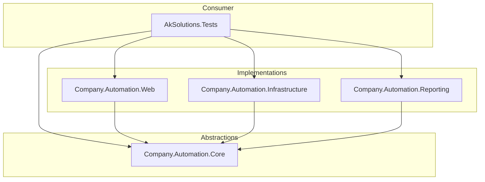

# Enterprise Automation Framework

A scalable, modular, and enterprise-grade test automation framework built with **.NET 8**, **Reqnroll (BDD)**, and **Playwright**. Designed to separate concerns clearly, ensuring maintainability and ease of use in CI/CD environments.

## 🏗️ Architecture Design

The project follows a **Modular Architecture** simulating an Enterprise NuGet distribution strategy. Each layer has a specific responsibility:



### Key Components

*   **Core**: Contains interfaces and abstractions (`IDriverFactory`, `ILoggerService`, `IConfigurationService`). It has no external dependencies on concrete tools.
*   **Infrastructure**: Concrete implementations for logging (Serilog) and configuration (`Microsoft.Extensions.Configuration`).
*   **Web**: The UI automation engine. Wraps Playwright to provide robust, retry-enabled interactions (`BrowserActions`) and base page models.
*   **Reporting**: A centralized `ReportingHub` that broadcasts test events to registered providers (Console, File, Allure, etc.).
*   **Tests**: The end-user project containing Feature files, Step Definitions, and Page Objects.

## 🚀 Getting Started

### Prerequisites
*   .NET 8 SDK
*   PowerShell (for Playwright install script)

### Installation

1.  Clone the repository.
2.  Install Playwright browsers:
    ```bash
    dotnet build
    pwsh ./AkSolutions.Tests/bin/Debug/net8.0/playwright.ps1 install
    ```

### Running Tests

Execute tests using the `dotnet test` command. You can filter by tags:

```bash
# Run all tests
dotnet test

# Run specific category
dotnet test --filter "Category=Smoke"

# Run with coverage
dotnet test --collect:"XPlat Code Coverage"
```

## 🛠️ Strategies & Patterns

1.  **Driver Factory**: Centralized browser lifecycle management, supporting local and CI execution (Headless/Headed).
2.  **Atomic Interactions**: Instead of raw Playwright calls, we use wrappers (e.g., `ClickAsync`, `TypeAsync`) that include smart waits, logging, and automatic retries.
3.  **Dependency Injection**: All services (Logger, Config, Driver) are injected via `Hooks.cs`, ensuring loose coupling and easy mocking.
4.  **WAF Bypass**: Includes stealth strategies (User-Agent rotation, automation flag removal) to handle Cloudflare challenges in CI.

## 💡 Recommendations

*   **Parallel Execution**: The framework is thread-safe. Configure `reqnroll.json` to enable parallel execution for faster feedback loops.
*   **Reporting**: Integrate **Allure** or **ReportPortal** by implementing `IReportProvider` in the Reporting project for rich historical data.
*   **Pipeline**: Use the provided `.github/workflows/dotnet.yml` as a template. Ensure the CI runner matches the configured User-Agent (Linux).
